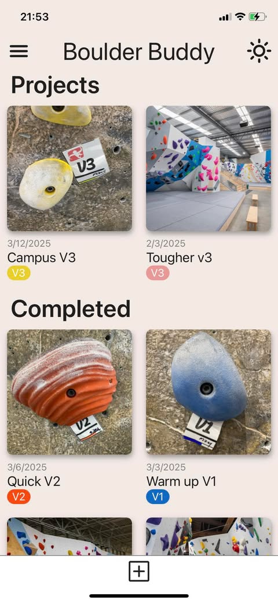
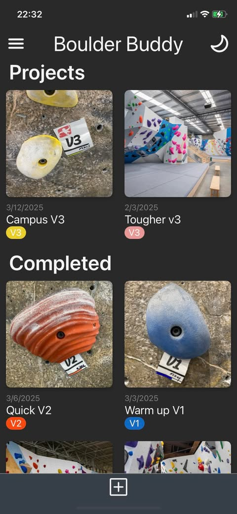

## Boulder Buddy Preview!

<p>
   
   
</p>

## Clone and run locally!

1. Clone the Repo above

2. Enter the file from your bash terminal

   ```bash
   cd 'your-install-folder'/BoulderBuddy/
   ```

3. Install dependencies

   ```bash
   npm install
   ```

4. Start the app

   ```bash
    npx expo start
   ```

In the output, you'll find options to open the app in a

- [development build](https://docs.expo.dev/develop/development-builds/introduction/)
- [Android emulator](https://docs.expo.dev/workflow/android-studio-emulator/)
- [iOS simulator](https://docs.expo.dev/workflow/ios-simulator/)
- [Expo Go](https://expo.dev/go), a limited sandbox for trying out app development with Expo

You can start developing by editing the files inside the **app** directory. This project uses [file-based routing](https://docs.expo.dev/router/introduction).

## User Flow Diagram

- https://www.figma.com/board/pnYUWR4kjqZ5x122PTjVkK/BoulderBuddy---User-Flow?node-id=0-1&t=KUNY5nsOsnGD38s7-1


## Wireframe

- https://www.figma.com/design/T8ESTC6kHkRo3uVgbAUCy9/BoulderBuddy---Wireframe?node-id=0-1&t=Y1haAzSDPsolfBaK-1


## Other Packages used

- https://www.npmjs.com/package/react-native-ui-datepicker
- https://www.npmjs.com/package/react-native-select-dropdown
- https://docs.expo.dev/versions/latest/sdk/imagepicker/
